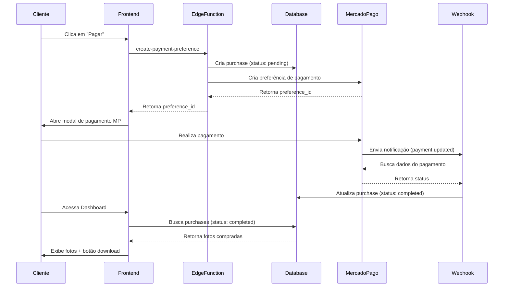

# Configuração do Sistema de Pagamentos

## 🎯 Como Funciona

1. **Cliente compra foto** → Sistema cria registro na tabela `purchases` com status `pending`
2. **Mercado Pago processa pagamento** → Envia notificação para o webhook
3. **Webhook atualiza status** → Status muda para `completed` quando aprovado
4. **Cliente acessa Dashboard** → Vê fotos compradas e pode baixar originais

## 📋 Configuração do Webhook no Mercado Pago

### Passo 1: Acessar Dashboard do Mercado Pago
1. Acesse: https://www.mercadopago.com.br/developers/
2. Vá em **Suas integrações** → Selecione sua aplicação
3. Clique em **Webhooks**

### Passo 2: Configurar URL do Webhook
Configure a URL do webhook como:
```
https://gtpqppvyjrnnuhlsbpqd.supabase.co/functions/v1/mercadopago-webhook
```

### Passo 3: Copiar Secret do Webhook
1. Após criar o webhook, copie a **Chave secreta** (Webhook Secret)
2. Esta chave já foi configurada como secret `MERCADO_PAGO_WEBHOOK_SECRET`
3. O sistema usa essa chave para validar que as notificações são realmente do Mercado Pago

### Passo 4: Selecionar Eventos
Marque o evento:
- ✅ **Pagamentos** (payments)

### Passo 5: Testar Webhook
O Mercado Pago enviará notificações quando:
- Pagamento for aprovado
- Pagamento for rejeitado
- Pagamento estiver pendente

## 🔄 Fluxo de Pagamento



## 🎨 Recursos Implementados

### ✅ Sistema de Compras
- [x] Modal de pagamento integrado no Mercado Pago
- [x] Checkout Bricks (modal na mesma página)
- [x] Criação automática de registro de compra
- [x] Webhook para atualização de status
- [x] Múltiplos clientes podem comprar a mesma foto

### ✅ Dashboard do Cliente
- [x] Visualização de todas as fotos compradas
- [x] Filtros por evento e busca
- [x] Ordenação por data, evento ou preço
- [x] Download de fotos originais (sem marca d'água)
- [x] Estatísticas de compras
- [x] Preview em modal de alta resolução

### ✅ Segurança
- [x] RLS policies para proteger dados
- [x] Validação de inputs com Zod
- [x] Webhooks autenticados
- [x] Download apenas para compradores

## 🧪 Testando o Sistema

### Teste em Sandbox (Modo de Teste)
1. Use cartões de teste do Mercado Pago
2. CPF de teste: `12345678909`
3. Cartões válidos: https://www.mercadopago.com.br/developers/pt/docs/checkout-api/testing

### Verificar Logs
```bash
# Ver logs do webhook
Ver em: https://supabase.com/dashboard/project/gtpqppvyjrnnuhlsbpqd/functions/mercadopago-webhook/logs

# Ver logs de criação de pagamento
Ver em: https://supabase.com/dashboard/project/gtpqppvyjrnnuhlsbpqd/functions/create-payment-preference/logs
```

## 🚀 Próximos Passos (Opcional)

### Melhorias Sugeridas
1. **Email de Confirmação**: Enviar email quando pagamento for aprovado
2. **Histórico de Pagamentos**: Adicionar histórico detalhado
3. **Reembolsos**: Sistema para processar devoluções
4. **Cupons de Desconto**: Sistema de cupons promocionais
5. **Assinatura**: Permitir planos mensais para acesso ilimitado

### Performance
1. **Cache**: Implementar cache para fotos frequentes
2. **CDN**: Usar CDN para servir fotos mais rápido
3. **Lazy Loading**: Carregar fotos sob demanda

## ❓ Troubleshooting

### Pagamento não atualiza status
- Verifique se o webhook está configurado corretamente
- Veja os logs do webhook para erros
- Confirme que o external_reference está sendo enviado

### Download não funciona
- Verifique RLS policies da tabela `purchases`
- Confirme que o status está como `completed`
- Verifique se a URL do arquivo está correta

### Modal do MP não abre
- Verifique se o SDK está carregando no `index.html`
- Veja console do navegador para erros
- Confirme public_key do Mercado Pago

## 📞 Suporte
Para dúvidas sobre integração:
- Docs Mercado Pago: https://www.mercadopago.com.br/developers/pt/docs
- Suporte Mercado Pago: https://www.mercadopago.com.br/ajuda
