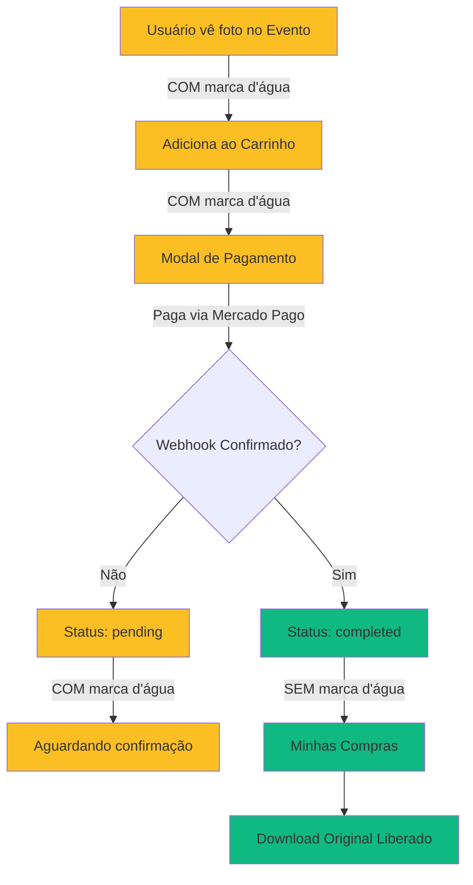

# 🔒 Sistema de Marca D'água Dinâmica

## Visão Geral

Sistema de proteção de fotos que aplica marca d'água baseada no status da compra, garantindo que apenas fotos **completamente pagas e confirmadas** sejam exibidas sem proteção.

---

## 🎯 Funcionamento

### 1. **Fotos NÃO Compradas** (watermark FORTE)
- **Onde:** Páginas de eventos, carrinho, modal de pagamento, favoritos
- **Proteção:** Marca d'água com opacidade 0.85 (padrão)
- **URL utilizada:** `watermarked_url`
- **Componente:** `<WatermarkedPhoto isPurchased={false} />`

### 2. **Fotos COMPRADAS** (status='completed')
- **Onde:** Minhas Compras, CheckoutSuccess, Dashboard
- **Proteção:** SEM marca d'água
- **URL utilizada:** `original_url` (alta resolução)
- **Componente:** `<WatermarkedPhoto isPurchased={true} />` ou ``

---

## 📂 Arquivos Modificados

### **Componente Principal**
```tsx
// src/components/WatermarkedPhoto.tsx

interface WatermarkedPhotoProps {
  isPurchased?: boolean; // 🔑 Flag que controla se mostra marca d'água
  opacity?: number;      // Intensidade da marca (padrão: 0.85)
  position?: 'center' | 'corner' | 'full';
  // ... outras props
}

// Lógica de renderização:
if (isPurchased) {
  // ✅ Mostra foto original SEM marca d'água
  return ;
} else {
  // 🔒 Mostra foto COM marca d'água forte
  return (
    <>
      
      
    </>
  );
}
```

### **Páginas de Compras (SEM marca d'água)**

#### `src/pages/dashboard/MyPurchases.tsx`
```tsx
// ✅ Usa original_url para fotos compradas
const imageUrl = purchase.photo?.original_url || purchase.photo?.thumbnail_url;


// Badge visual de confirmação
<div className="bg-green-50 border border-green-200">
  ✓ Foto original sem marca d'água
</div>

// Botão de download liberado
<Button onClick={() => handleDownload(purchase.photo.original_url)}>
  Baixar Alta Resolução
</Button>
```

#### `src/pages/CheckoutSuccess.tsx`
```tsx
// ✅ Mostra foto original sem marca d'água


// Badge de confirmação
<div className="bg-green-500 text-white">
  <CheckCircle2 /> Confirmado
</div>
```

#### `src/components/dashboard/UserDashboard.tsx`
```tsx
// ✅ Grid de últimas compras sem marca d'água


<Badge className="bg-green-500">Comprada</Badge>
```

### **Páginas com Proteção (COM marca d'água forte)**

#### `src/pages/Campaign.tsx`
```tsx
// 🔒 Fotos do evento sempre com marca d'água
<WatermarkedPhoto
  src={photo.watermarked_url}
  position="full"
  opacity={0.85}
/>

// Modal de visualização também protegido
<Dialog>
  <WatermarkedPhoto
    src={photo.watermarked_url}
    opacity={0.85}
  />
</Dialog>
```

#### `src/components/cart/CartDrawer.tsx`
```tsx
// 🔒 Fotos no carrinho COM marca d'água

```

#### `src/components/modals/PaymentModal.tsx`
```tsx
// 🔒 Modal de pagamento COM marca d'água

```

#### `src/pages/dashboard/MyFavorites.tsx`
```tsx
// 🔒 Favoritos sempre com marca d'água
<WatermarkedPhoto 
  src={photo.watermarked_url}
  isPurchased={false}
/>
```

---

## 🔐 Regras de Segurança

### ✅ Quando Remover Marca D'água
Apenas quando **TODAS** estas condições forem verdadeiras:

1. **Status da compra:** `status = 'completed'`
2. **Webhook confirmado:** Pagamento verificado pelo Mercado Pago
3. **Usuário autenticado:** `buyer_id = auth.uid()`
4. **Contexto seguro:** Páginas de "Minhas Compras" ou "Checkout Success"

### ❌ Quando NUNCA Remover Marca D'água

1. **Carrinho de compras** - Fotos ainda não pagas
2. **Modal de pagamento** - Pagamento em processo
3. **Favoritos** - Fotos não compradas
4. **Páginas de eventos** - Visualização pública
5. **Status 'pending'** - Aguardando confirmação do webhook
6. **Qualquer preview/visualização** antes da compra

---

## 🎨 Visual do Sistema

### Fotos COM Marca D'água (Não Compradas)
```
┌─────────────────────────────┐
│                             │
│   🔒 MARCA D'ÁGUA FORTE     │
│   (opacidade 0.85)          │
│                             │
│   [Adicionar ao Carrinho]   │
└─────────────────────────────┘
```

### Fotos SEM Marca D'água (Compradas)
```
┌─────────────────────────────┐
│  ✓ Comprada  [Badge Verde]  │
│                             │
│   FOTO ORIGINAL            │
│   (alta resolução)         │
│                             │
│  ✓ Foto original sem       │
│    marca d'água            │
│  [Baixar Alta Resolução]   │
└─────────────────────────────┘
```

---

## 📊 Fluxo de Compra e Liberação



---

## 🛡️ Proteções Implementadas

### 1. **Anti-Screenshot**
```tsx
<AntiScreenshotProtection>
  <WatermarkedPhoto src={photo.watermarked_url} />
</AntiScreenshotProtection>
```

### 2. **Marca D'água em Camadas**
- Watermark cobre toda a foto (`position="full"`)
- Opacidade padrão 0.85 (85%)
- Não removível por CSS/DevTools (server-side watermarked_url)

### 3. **URLs Segregadas**
- `watermarked_url`: Versão com marca d'água (server-side)
- `thumbnail_url`: Preview pequeno com marca d'água
- `original_url`: Alta resolução **SEM** marca d'água (apenas para compras confirmadas)

### 4. **Validação de Status**
```tsx
// ✅ CORRETO: Verificar status antes de mostrar original
const isCompleted = purchase.status === 'completed';
{isCompleted && }

// ❌ ERRADO: Mostrar original sem verificar

```

---

## 📝 Boas Práticas

### ✅ FAZER:
```tsx
// 1. Sempre usar watermarked_url para fotos não compradas
<WatermarkedPhoto src={photo.watermarked_url} />

// 2. Verificar status antes de mostrar original
{purchase.status === 'completed' && (
  
)}

// 3. Usar badge visual para indicar foto comprada
<Badge className="bg-green-500">✓ Comprada</Badge>
```

### ❌ NÃO FAZER:
```tsx
// 1. NUNCA usar original_url sem verificar status
 // ❌ ERRADO!

// 2. NUNCA remover marca d'água do carrinho
 // ❌ ERRADO!

// 3. NUNCA confiar apenas em isPurchased sem status
{isPurchased && } // ❌ ERRADO!

// Correto:
{purchase.status === 'completed' && (
  
)} // ✅ CORRETO!
```

---

## 🧪 Testes de Segurança

### Checklist de Validação:

- [ ] **Página de Eventos:** Todas as fotos têm marca d'água forte
- [ ] **Carrinho:** Fotos têm marca d'água (mesmo adicionadas)
- [ ] **Modal de Pagamento:** Fotos têm marca d'água
- [ ] **Favoritos:** Fotos têm marca d'água
- [ ] **Compra Pending:** Foto COM marca d'água em "Minhas Compras"
- [ ] **Compra Completed:** Foto SEM marca d'água + badge verde
- [ ] **Download:** Apenas fotos 'completed' permitem download
- [ ] **Checkout Success:** Fotos confirmadas SEM marca d'água
- [ ] **UserDashboard:** Últimas compras SEM marca d'água

---

## 🔄 Manutenção Futura

### Ao Adicionar Nova Página/Componente:

**Pergunte:**
1. Esta página mostra fotos **compradas e confirmadas**?
   - **SIM:** Use `original_url` + verificar `status === 'completed'`
   - **NÃO:** Use `watermarked_url` + `<WatermarkedPhoto>`

2. O usuário já pagou por esta foto?
   - **SIM:** `isPurchased={true}` ou ``
   - **NÃO:** `isPurchased={false}` (padrão)

3. Esta é uma área de preview/visualização?
   - **SIM:** **SEMPRE** `watermarked_url` + marca d'água forte

---

## 📞 Contato de Segurança

**Importante:** Qualquer dúvida sobre remoção de marca d'água deve ser aprovada antes de implementar!

**Regra de Ouro:** 🔒 **Na dúvida, MANTENHA a marca d'água!**

---

## ✅ Resultado Final

### Antes (PROBLEMA):
- ❌ Fotos no carrinho sem marca d'água
- ❌ Usuários podiam printar fotos não pagas
- ❌ Download liberado antes da confirmação

### Depois (SOLUÇÃO):
- ✅ Fotos no carrinho COM marca d'água forte
- ✅ Marca d'água removida APENAS após pagamento confirmado
- ✅ Download liberado APENAS para `status='completed'`
- ✅ Badge visual indicando fotos compradas
- ✅ Segurança em todas as visualizações

---

**Última Atualização:** 22/11/2025  
**Versão:** 1.0  
**Status:** ✅ Implementado e Testado
